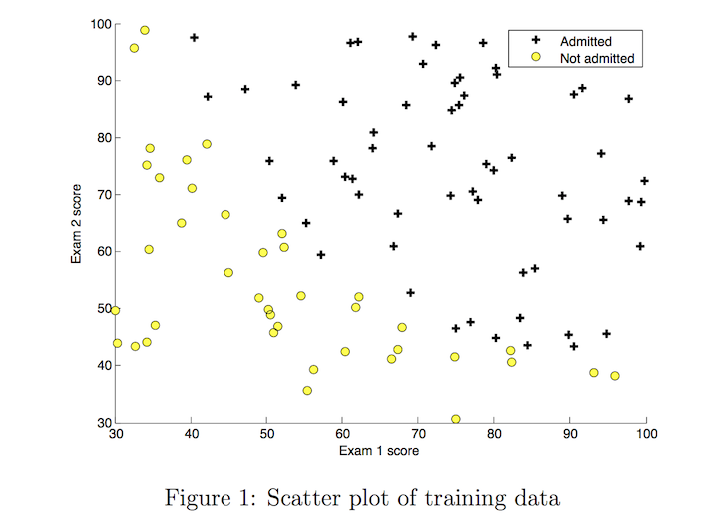
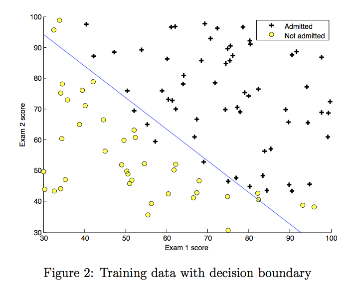
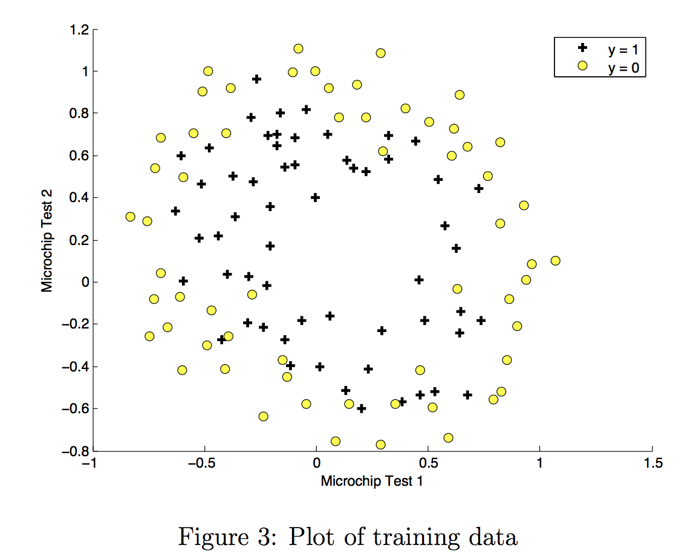
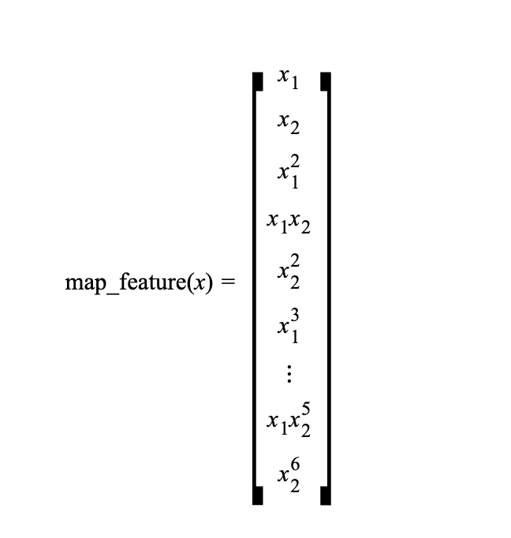
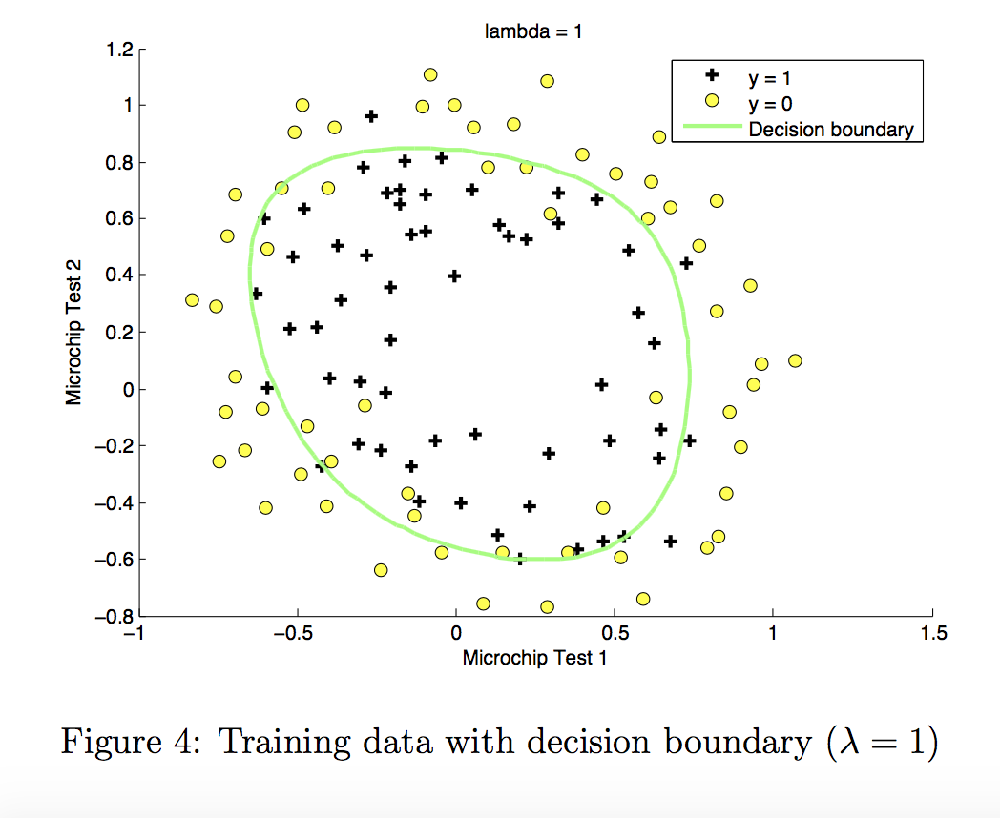
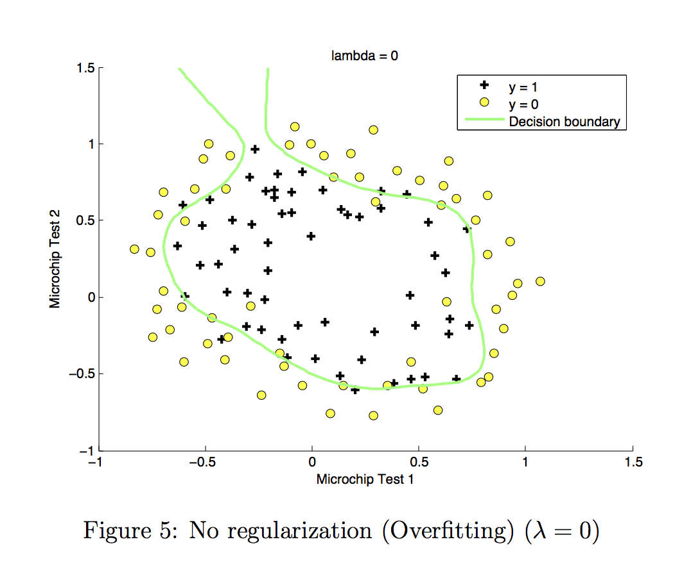
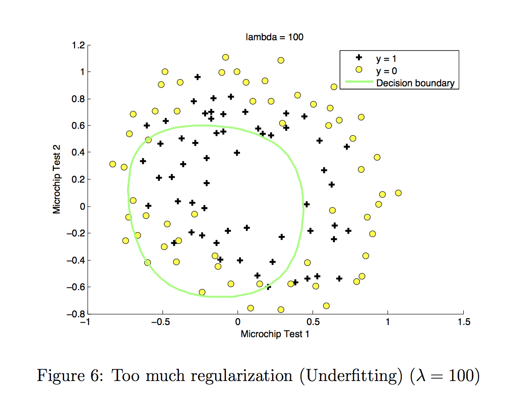

# Logistic_Regression

This repository contains the implementation of logistic regression for two different scenarios: predicting university admission based on exam scores, and determining the acceptability of microchips based on QA test results.

## Table of Contents
1. [Logistic Regression](#logistic-regression)
    1. [Problem Statement](#problem-statement-1)
    2. [Loading and Visualizing the Data](#loading-and-visualizing-the-data-1)
    3. [Plotting the Decision Boundary](#plotting-the-decision-boundary-1)
2. [Regularized Logistic Regression](#regularized-logistic-regression)
    1. [Problem Statement](#problem-statement-2)
    2. [Loading and Visualizing the Data](#loading-and-visualizing-the-data-2)
    3. [Feature Mapping](#feature-mapping)
    4. [Plotting the Decision Boundary](#plotting-the-decision-boundary-2)

## 1 - Logistic Regression

### 1.1 Problem Statement:
Suppose that you are the administrator of a university department and you want to determine each applicant’s chance of admission based on their results on two exams.

You have historical data from previous applicants that you can use as a training set for logistic regression.
For each training example, you have the applicant’s scores on two exams and the admissions decision.
Your task is to build a classification model that estimates an applicant’s probability of admission based on the scores from those two exams.

### 1.2 Loading and visualizing the data
    

    
    

### 1.3 Plotting the decision boundary:
    

    
    

We will now use the final parameters from gradient descent to plot the linear fit.

## 2 - Regularized Logistic Regression

### 2.1 Problem Statement:
Suppose you are the product manager of a factory and you have the test results for some microchips on two different tests.

From these two tests, you would like to determine whether the microchips should be accepted or rejected.
To help you make the decision, you have a dataset of test results on past microchips, from which you can build a logistic regression model.

### 2.2 Loading and visualizing the data:
    

    
    

### 2.3 Feature mapping:
    

    
    

One way to fit the data better is to create more features from each data point. In the provided function `map_feature`, we will map the features into all polynomial terms of x1 and x2 up to the sixth power.
As a result of this mapping, our vector of two features (the scores on two QA tests) has been transformed into a 27-dimensional vector.

A logistic regression classifier trained on this higher-dimension feature vector will have a more complex decision boundary and will be nonlinear when drawn in our 2-dimensional plot.
We have provided the `map_feature` function for you in `utils.py`.

### 2.4 Plotting the decision boundary:
    

    
    

    

    
    

    

    
    

